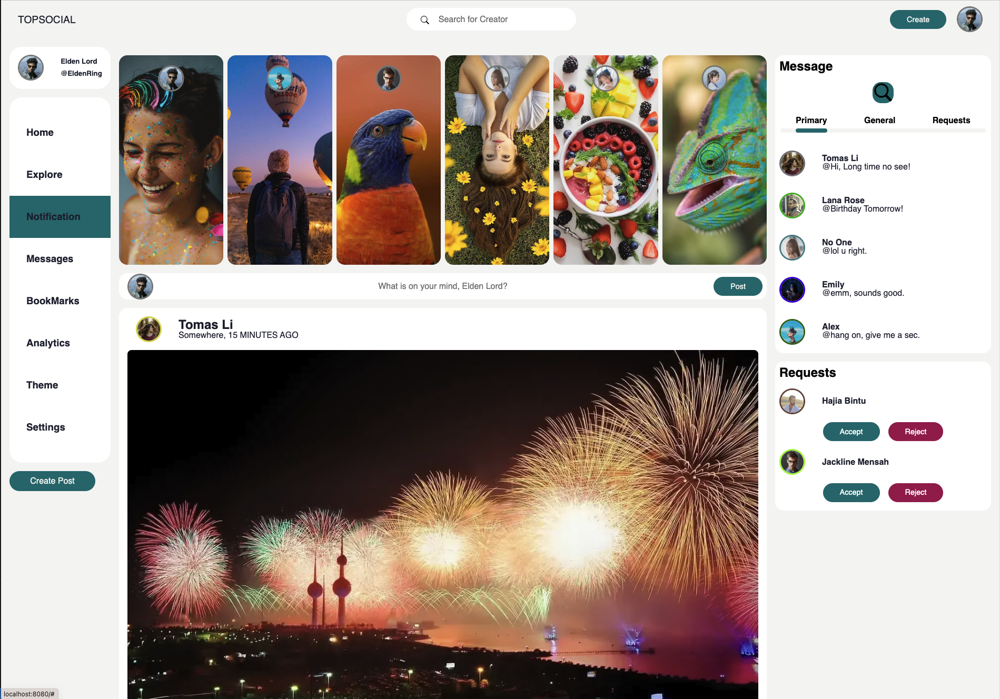

# WEB-PROJECT

## How to use:

1. Clone the repo

2. Install dependencies

### frontend

```
cd frontend_example

npm install

npm run dev
```

### backend

```
cd backend_service

npm install

npm run json:server
```

Project will be running on `http://localhost:8080/`

